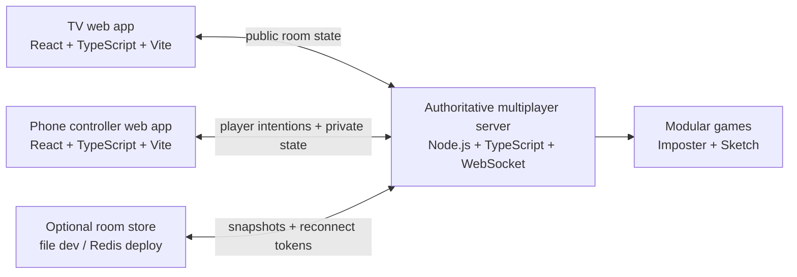

# Group Crash

Group Crash is a web-first second-screen multiplayer game platform for TV and phone controllers.

The TV shows the shared lobby and game experience. Players scan a QR code, join from their phones, send quick messages, request host control, vote on host changes, and eventually use their phones as private controllers for modular party games.

The current build includes the lobby, host room controls, public deployment, restart-persistence hooks, and two playable modular games: `Imposter Crash` and `Sketch Crash`.

## Live Demo

```text
TV app: https://crashtv.formawebsite.com
Phone controller: https://crash-join.formawebsite.com
```

## Portfolio Links

- [Portfolio case study](docs/portfolio-case-study.md)
- [Demo recording script](docs/demo-script.md)
- [Reliability plan](docs/reliability.md)
- [Deployment guide](docs/deployment.md)

## MVP Scope

The lobby MVP includes:

- TV room creation with room code and QR join link
- Phone join flow with display name, chess avatar, and role preference
- Live connected player list on the TV
- Current host indicator
- Host request and majority host-transfer vote
- Voluntary room leave with automatic host reassignment
- Quick messages from phones to the TV lobby
- Host room lock and 2-8 player capacity control
- Host mute and kick controls
- Modular game registry with non-playable `Demo Crash` plus playable `Imposter Crash` and `Sketch Crash`
- Host-only game selection
- Selected game display on TV and host controller
- Server-authoritative room state
- Reconnectable player sessions
- Optional room persistence using a local file store or Redis-compatible store

The MVP does not include:

- Public matchmaking
- User accounts
- Persistent profiles
- Voice chat
- Native Android TV wrapper
- User accounts and persistent player profiles
- Payment or monetization

## Design Source

The visual source of truth is the Figma file:

https://www.figma.com/design/7xGXtygVpXnPd6aNSXeTBV

The implementation should follow the Group Crash design system:

- Bright red environment
- Yellow emphasis for host authority, focus, and primary actions
- Cream readable surfaces
- Dark ink text
- Large rounded typography
- Thick outlines
- Generous negative space
- Chess-piece player avatars

## Planned Architecture



The Android TV app will come later as a thin WebView wrapper around the TV web app. The product should be built and proven in the browser first.

## Planned Repository Shape

```text
group-crash/
+-- AGENTS.md
+-- README.md
+-- docs/
|   +-- product-spec.md
|   +-- design-system.md
|   +-- lobby-rules.md
|   +-- architecture.md
|   +-- protocol.md
|   +-- acceptance-tests.md
|   +-- deployment.md
+-- apps/
|   +-- tv/
|   +-- controller/
|   +-- server/
+-- packages/
|   +-- design-tokens/
|   +-- protocol/
|   +-- ui/
|   +-- game-engine/
|   +-- game-sdk/
+-- games/
```

## Development Order

1. Build static TV and phone lobby screens from mocked data.
2. Add local lobby interaction without networking.
3. Connect TV and phones through the server.
4. Harden reconnect grace, room expiration, and tests.
5. Add modular game registry shell.
6. Build playable game modules.
7. Deploy a public browser test build.
8. Package the TV client for Google TV after the browser version works reliably.

## Current Status

The public browser MVP is live. The TV and phone controller connect to an authoritative WebSocket server for room creation, joining, shouts, host requests, host votes, host transfer, reconnect grace, room expiration, room lock/capacity controls, host mute/kick actions, host-only game selection, and playable `Imposter Crash` and `Sketch Crash` loops.

The server keeps secret roles, prompts, drawing strokes, guesses, and game results authoritative, sends private state only to the correct player's phone, and broadcasts public game state to the TV.

See [docs/deployment.md](docs/deployment.md) for the public test deployment plan.
