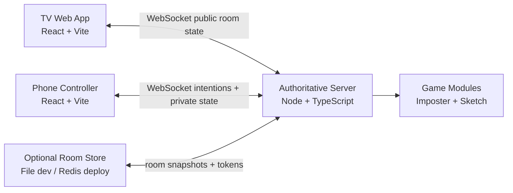

# Group Crash Portfolio Case Study

## One-Line Pitch

Group Crash is a web-first multiplayer party-game platform where a TV acts as
the shared game screen and each player's phone becomes a private controller.

## Live Demo

```text
TV app: https://crashtv.formawebsite.com
Phone controller: https://crash-join.formawebsite.com
```

## What It Demonstrates

- Real-time multiplayer synchronization
- Authoritative server-side game state
- Public TV state and private phone state
- QR-based room joining
- Reconnectable sessions
- Host transfer and majority voting
- Modular game registry
- Two playable game modules
- Responsive TV and phone interfaces
- Public deployment with custom domains

## Architecture



## Core Engineering Decisions

The TV is display-only. It creates or watches a room, but it does not add
players, vote, send messages, or control games.

Phones send intentions. The server decides whether each action is valid, updates
state, and broadcasts the accepted result.

Private game information stays private. For example, Imposter Crash sends each
phone only that player's role and clue, while the TV receives only public phase
and progress state.

The Android TV plan is a thin WebView wrapper. The TV app can load the hosted web
experience, which means new web games and UI improvements can ship without
submitting a Google Play update every time.

## Current Game Modules

### Imposter Crash

A social deduction game where crew players know the secret word and one imposter
only sees the category.

### Sketch Crash

A drawing-and-guessing game where one phone becomes the drawing pad and the TV
shows the live sketch.

## Reliability Work

The server now supports optional room persistence. Restored rooms keep room
state, reconnect tokens, host settings, active game state, and lobby messages.

The TV app stores its room code locally so it can re-watch the same room after a
server restart.

## Room Controls

The current host can:

- Lock or unlock the room
- Set capacity from 2 to 8 players
- Mute or unmute player shouts
- Kick players from the room
- Pass host to a selected player
- Select and start playable game modules

## What I Would Improve Next

- Add a durable hosted Redis store for public persistence
- Add host confirmation dialogs for kicking players
- Add game timers and stronger round transitions
- Add sound effects and result animations
- Package the TV app in an Android TV WebView shell
- Add automated browser screenshots to the release checklist
